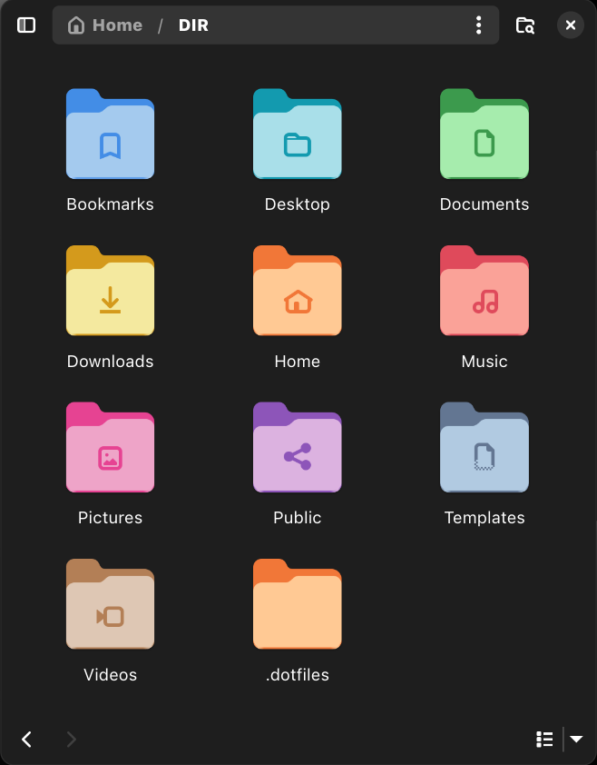

# Adwaita-colors



Adwaita Colors enhances the Adwaita icon theme by integrating GNOME’s accent color feature, introduced in GNOME 47. This project ensures that your Adwaita icons reflect the same accent color as your GNOME theme, instead of the default blue, for a more cohesive and customized look.
Motivation

GNOME 47 introduced a "color accent" feature to allow users to select a system-wide accent color. However, the default Adwaita icon theme does not automatically adapt to this accent color, leaving the icons in the default blue. Adwaita Colors fixes this by applying your chosen accent color to the icons.

In addition, I added MoreWaita icon folders and made them themed to allow for more extensive customization.

## Installation:

Clone the repository to your local machine:

```sh
git clone https://github.com/dpejoh/Adwaita-colors
```

To install the icons for your user, copy the Adwaita-colors folder to:

```sh
cp -r ./Adwaita-colors/* ~/.local/share/icons/
```

To install the icons globally for all users, use:

```sh
cp -r ./Adwaita-colors/* /usr/share/icons/
```
Once the icons are installed and integrated, apply the theme through GNOME Tweaks.

## Integrating with MoreWaita:

If you're using the MoreWaita theme, follow these steps to integrate it with Adwaita Colors:

In the index.theme file, add MoreWaita at the beginning of the Inherits= line:

`Inherits=MoreWaita,Adwaita`

In the scalable directory, delete all icons except the folder icons and the gnome-tweaks icon (those that are already included in the MoreWaita icon set). This ensures there are no conflicts or duplicates.


## Auto Match Adwaita-color with Accent Colors:

To automatically match your color accent with the Adwaita theme, you can install the "Auto Adwaita Colors" extension by [@celiopy](https://github.com/celiopy/auto-adwaita-colors).

### Installation:

Download the extension from the latest release, or run the following command:

```sh
wget https://github.com/celiopy/auto-adwaita-colors/releases/download/1.0/auto-adwaita-colors@celiopy.zip
```

Install the extension using GNOME:

```sh
gnome-extensions install --force "auto-adwaita-colors@celiopy.zip"
```

After installation, open the GNOME Extensions Manager and enable the extension from there.
