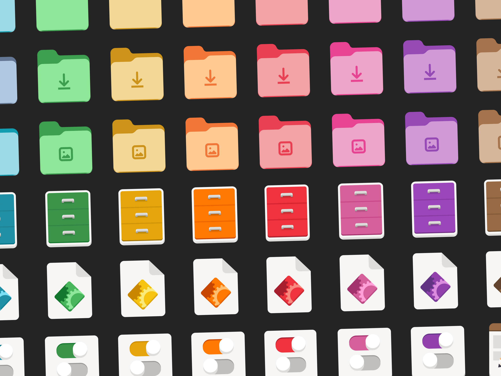

# Adwaita-colors



Adwaita Colors enhances the Adwaita icon theme by integrating GNOME’s accent color feature, introduced in GNOME 47. This project ensures that your Adwaita icons reflect the same accent color as your GNOME theme, instead of the default blue, for a more cohesive and customized look.

GNOME 47 introduced a "color accent" feature to allow users to select a system-wide accent color. However, the default Adwaita icon theme does not automatically adapt to this accent color, leaving the icons in the default blue. Adwaita Colors fixes this by applying your chosen accent color to the icons.

In addition, I added MoreWaita icon folders and made them themed to allow for more extensive customization.

## Installation:

### Requirements:

This theme will not work properly without the original Adwaita icon theme.

### Regular installation (Recommended & Updated):

Clone the repository to your local machine:

```sh
git clone https://github.com/dpejoh/Adwaita-colors
```

To install the icons globally, simply run:

```sh
sudo cp -r ./Adwaita-colors/* /usr/share/icons/
```
For immutable distros like Fedora Silverblue, the global installation is different, use:

```sh
sudo cp -r ./Adwaita-colors/* /var/usrlocal/share/icons/
```
For removing the icon theme run:
```sh
sudo rm -rf /usr/share/icons/Adwaita-*
```
> [!NOTE]
> You can also install the icon theme in the user directory without any problems, but for best compatibility with apps, it is recommended to install it system-wide.

### Install with package manager:

From v2.4.1, a .deb and .rpm packages is available on [GitHub latest release](https://github.com/dpejoh/Adwaita-colors/releases/tag/v2.4.1)

### Ubuntu, Debian-based distros:

Download the latest version from GitHub:
```sh
wget https://github.com/dpejoh/Adwaita-colors/releases/download/v2.4.1/adwaita-colors-theme-2.4.1.deb
```
Install it:
```sh
sudo dpkg -i adwaita-colors-theme-2.4.1.deb
```
### Fedora, CentOS and RHEL:

Download the latest version from GitHub:
```sh
wget https://github.com/dpejoh/Adwaita-colors/releases/download/v2.4.1/adwaita-colors-theme-2.4.1.rpm
```
Install it:
```sh
sudo dnf install adwaita-colors-theme-2.4.1.rpm
```

### Arch Linux (AUR):

Release-based [adwaita-colors-icon-theme](https://aur.archlinux.org/packages/adwaita-colors-icon-theme):  
```sh
paru adwaita-colors-icon-theme
```
<sup>*Replace `paru` with `yay -S` or your favourite AUR helper install command.</sup>

Git-based [adwaita-colors-icon-theme-git](https://aur.archlinux.org/packages/adwaita-colors-icon-theme-git) for keeping up with all git changes between releases:  
```sh
paru adwaita-colors-icon-theme-git
```
<sup>*Replace `paru` with `yay -S` or your favourite AUR helper install command.</sup>

> [!TIP]
> Once the icons are installed, apply the theme through GNOME Tweaks.

## MoreWaita:

To install MoreWaita with Adwaita-colors:

- Ensure that MoreWaita is installed.
- Run MoreWaita.sh after cloning the repository, or run command below directly:

#### With sudo:
```sh
wget -O MoreWaita.sh https://raw.githubusercontent.com/dpejoh/Adwaita-colors/main/MoreWaita.sh && chmod +x MoreWaita.sh && sudo ./MoreWaita.sh
```

> [!NOTE]
 
> Arch Linux AUR packages integrate with MoreWaita automatically.
## Auto Match Adwaita-color with Accent Colors:

To automatically match your color accent with the Adwaita theme, you can install the "Auto Adwaita Colors" extension by [@celiopy](https://github.com/celiopy/auto-adwaita-colors).

### Installation:

You can install the extension directly from GNOME Shell Extensions:

[](https://extensions.gnome.org/extension/7529/auto-adwaita-colors/)

Or download the latest release from GitHub by running the following command:

```sh
wget https://github.com/celiopy/auto-adwaita-colors/releases/download/3.0/auto-adwaita-colors@celiopy.zip
```

Install the extension using GNOME:

```sh
gnome-extensions install --force "auto-adwaita-colors@celiopy.zip"
```

After installation, open the GNOME Extensions Manager and enable the extension from there.
